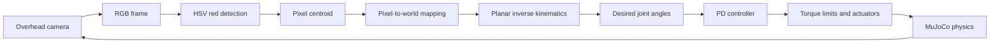

# Sight2Servo

Sight2Servo is a learning-first vision-guided robotics project built in
MuJoCo. A fixed overhead camera observes a red target, computer vision finds
its image centroid, geometry maps that pixel into the robot's workspace,
inverse kinematics produces desired joint angles, and a PD controller drives a
two-link arm toward the target.

The project was developed alongside robotics study sessions. Each subsystem
was implemented and verified separately before being connected into the final
closed loop.

## Architecture



The controller never reads the target's true simulator position. Ground truth
is used to place the target in the environment and to evaluate positioning or
tracking error; it is not an input to the robot's decision pipeline.

## Status

The technical implementation and four experiments are complete:

- Two-link planar arm, torque actuators, target, and fixed overhead camera
- Manual forward kinematics verified against MuJoCo
- Two-solution geometric inverse kinematics with reachability checks
- P and PD joint control with torque saturation
- RGB camera rendering and HSV red-target detection
- Largest-contour centroid extraction
- Pixel-to-world coordinate mapping
- Repeated camera-to-control loop with a moving target
- P-versus-PD controller experiment
- Perception-noise experiment with 20 trials per noise level
- Control-frequency experiment across six rates and three joint targets
- Perception-latency experiment across six delays on a moving-target trajectory
- Automated tests for model, kinematics, control, vision, and transforms

## Demo

[Watch the moving-target demonstration](assets/demo/sight2servo.mov)

The recording shows the target changing location, new camera-derived centroid
and IK values appearing in the terminal, and the arm responding to the updated
visual observation.

## Setup

Requirements:

- Python 3.11 or newer
- [uv](https://docs.astral.sh/uv/)
- macOS for the documented `mjpython` viewer command

Install the locked dependencies:

```bash
uv sync
```

## Run the closed loop

On macOS, launch the complete moving-target demonstration with `mjpython`:

```bash
PYTHONPATH=src mjpython -m sight2servo.main
```

The simulation runs camera perception at 25 Hz and PD control at the 500 Hz
physics rate. Halfway through the run, the target moves to a new location. The
arm must detect the change through the camera and recompute its joint targets.

## Run the experiments

Controller comparison:

```bash
PYTHONPATH=src uv run python experiments/controller_comparison.py
```

Perception-noise experiment:

```bash
PYTHONPATH=src uv run python experiments/perception_noise.py
```

The noise experiment performs 80 offscreen simulation runs and therefore
takes longer than the controller comparison.

Control-frequency experiment (18 configurations):

```bash
PYTHONPATH=src uv run python experiments/control_frequency.py
```

Perception-latency experiment (six delay conditions plus a zero-delay diagnostic):

```bash
PYTHONPATH=src uv run python experiments/perception_latency.py
```

The frequency experiment saves summary metrics and one plot per target. The
latency experiment saves summary metrics, full error histories, and a plot.
CSV outputs are in `assets/results/`; plots are in `assets/plots/`.

## Results

### P versus PD control

| Metric | P | PD |
|---|---:|---:|
| Final joint-space error | 0.5993 rad | 0.0193 rad |
| Shoulder overshoot | 0.4884 rad | 0.1430 rad |
| Elbow overshoot | 0.5591 rad | 0.0113 rad |
| Settling time | Did not settle within 4 s | 3.242 s |
| Shoulder target crossings | 5 | 3 |
| Elbow target crossings | 18 | 2 |


PD control reduced overshoot and sustained oscillation by opposing joint
velocity. See the full
[controller comparison report](experiments/controller_comparison.md).

### Perception noise

| Pixel noise | Mean final error | Standard deviation |
|---|---:|---:|
| 0 px | 15.513 mm | 0.000 mm |
| ±1 px | 14.405 mm | 1.903 mm |
| ±5 px | 14.284 mm | 2.669 mm |
| ±10 px | 11.015 mm | 5.508 mm |


Noise did not monotonically increase mean final error. Interaction with
self-occlusion is a possible explanation, but was not independently verified.
Noise did consistently increase trial-to-trial variability in these runs. See
the full [perception-noise report](experiments/perception_noise.md).

### Control frequency

PD updates were varied from 10 to 500 Hz while physics stayed at 500 Hz, with
the same gains and torque limits. Across all three tested joint targets,
10 and 25 Hz did not settle within eight seconds; 50 through 500 Hz settled.
Differences among the higher rates were smaller and depended on the metric
and target. These results do not establish a universal minimum update rate.

See the [control-frequency report](experiments/control_frequency.md) for
all 18 configurations, metric definitions, plots, and CSV results.

### Perception latency

Camera-derived target estimates were delayed by 0, 10, 20, 50, 100, or 200 ms
while camera sampling stayed at 25 Hz and PD control at 500 Hz. The cube
followed the same eight-second out-and-back path after a four-second warmup.

| Added latency (ms) | Tracking RMSE (mm) | Peak error (mm) | Final error (mm) |
|---:|---:|---:|---:|
| 0 | 15.601 | 22.471 | 14.673 |
| 10 | 15.400 | 21.427 | 16.745 |
| 20 | 15.261 | 22.744 | 17.096 |
| 50 | 14.473 | 23.677 | 15.628 |
| 100 | 14.655 | 25.287 | 15.927 |
| 200 | 14.401 | 31.877 | 3.803 |

The 200 ms condition increased peak error by approximately 41.9% relative to
zero delay, but did not increase whole-window RMSE. Effects were not uniformly
monotonic. Self-occlusion remained part of the vision loop.

See the [perception-latency report](experiments/perception_latency.md) for the
delay model, plot, saved error histories, and limitations.

## Component demos

Inspect simulation state:

```bash
uv run python src/sight2servo/simulation.py
```

Run IK-driven PD control:

```bash
PYTHONPATH=src uv run python -m sight2servo.ik_pd_demo
```

Render an overhead frame:

```bash
PYTHONPATH=src uv run python -m sight2servo.camera_demo
```

Detect and mark the target centroid:

```bash
PYTHONPATH=src uv run python -m sight2servo.vision_demo
```

Open the model directly in the MuJoCo viewer:

```bash
mjpython -m mujoco.viewer --mjcf=models/arm.xml
```

## Tests

```bash
uv run pytest -q
```

The complete suite contains 32 tests. Camera-rendering tests require a usable
macOS graphics context.

## Limitations

- The arm is planar and simulated rather than a physical robot.
- The fixed monocular camera assumes a known horizontal target plane.
- Pixel-to-world mapping uses known camera geometry instead of full camera
  calibration.
- HSV color thresholding recognizes only the configured red target.
- The arm can partially hide the target, shifting the visible red centroid and
  causing closed-loop oscillation.
- The controller always selects the first valid IK solution rather than
  optimizing configuration continuity or obstacle avoidance.
- The noise experiment measures final error only; the frequency and latency
  experiments also measure error across their observation windows.
- Frequency results cover three joint targets; latency results cover one
  moving-target trajectory with fixed simulated delay and existing self-occlusion.

## Future work

- Handle occlusion using target tracking, filtering, or a second camera
- Calibrate the camera from observations instead of fixed model parameters
- Extend latency measurements to more trajectories, speeds, and variable delays
- Select IK solutions based on current joint configuration
- Extend the arm and perception pipeline to 3D
- Transfer the pipeline to a physical robot

See [DEVELOPMENT.md](DEVELOPMENT.md) for the milestone-by-milestone learning
record.
