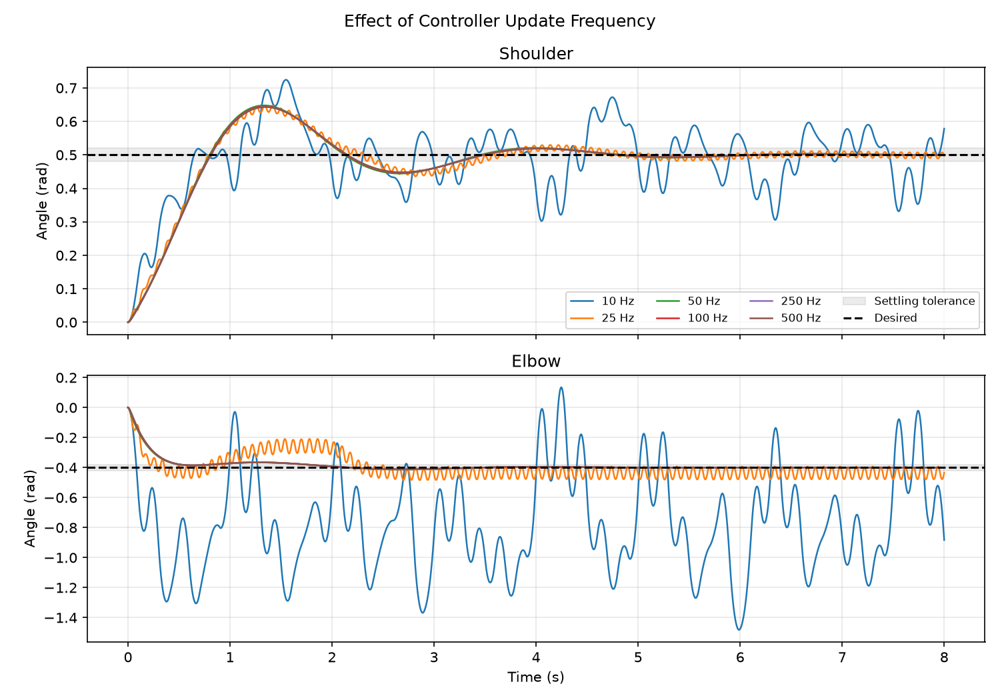
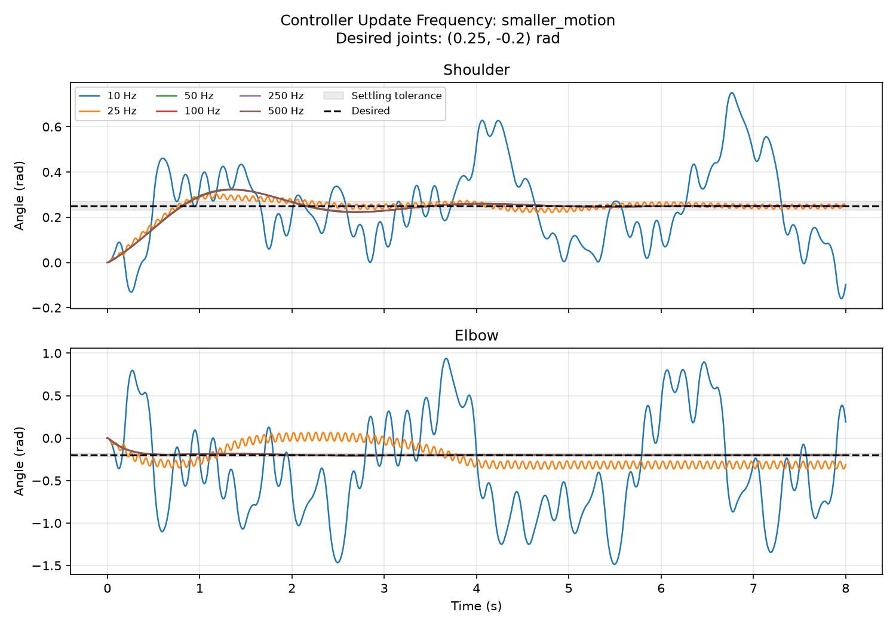
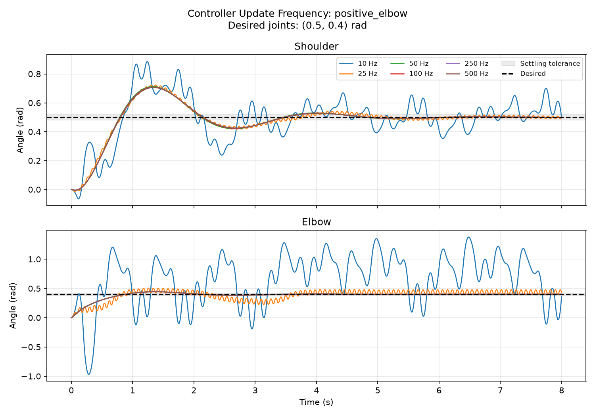

# Control Frequency Experiment

## Question

How does the PD controller update frequency affect joint positioning when the
physics timestep, gains, torque limits, initial state, and target stay fixed?

## Hypothesis

Less frequent feedback updates will increase oscillation and positioning
error. Higher rates are expected to improve settling, with diminishing
differences once updates are sufficiently frequent for this setup.

## Setup

- Model: `models/arm.xml`, unchanged across runs
- Initial joint positions and velocities: `(0.0, 0.0)`
- Desired shoulder and elbow angles: baseline `(0.5, -0.4)`, smaller motion
  `(0.25, -0.2)`, and positive elbow `(0.5, 0.4)` rad
- Controller rates: 10, 25, 50, 100, 250, and 500 Hz
- Physics timestep: 0.002 s (500 Hz) at every controller rate
- PD gains: Kp = 0.2 Nm/rad, Kd = 0.05 Nm s/rad
- Torque limit: +/-0.2 Nm per joint
- Duration: 8 s per run
- Samples: 4001 per run, including the initial state
- Settling tolerance: +/-0.02 rad for each joint

Each rate starts from a fresh simulation state. Both joint torques are updated
together every 50, 20, 10, 5, 2, or 1 physics steps, respectively. Between
controller updates, the previously commanded torques remain applied. Physics
continues stepping at 500 Hz throughout.

This is a deterministic joint setpoint experiment: one run per frequency for
each of three target configurations (18 runs total). Comparisons between
frequencies are made within each configuration. It does not use camera observations, artificial
noise, or moving targets. No gains are retuned between rates.

## Measurements

- Joint RMSE: square root of the mean squared error across both joints and
  all 4001 samples, including the initial approach, in radians.
- Final joint error: Euclidean norm of the two joint errors at the final
  sample, in radians. Unlike RMSE, this does not average across joints or time.
- Overshoot: maximum excursion beyond each desired angle in the direction
  from its initial position toward that angle; zero if no overshoot occurs.
- Settling time: first sample after the last tolerance violation by either
  joint. Both joints must remain within tolerance for the rest of the recorded
  window. A blank CSV field means the final sample is still outside tolerance.

## Results

Baseline configuration `(0.5, -0.4)` rad:

| Control rate (Hz) | Joint RMSE (rad) | Final error (rad) | Shoulder overshoot (rad) | Elbow overshoot (rad) | Settling time (s) |
|---:|---:|---:|---:|---:|---:|
| 10 | 0.357133 | 0.489350 | 0.224337 | 1.081480 | Not settled within 8 s |
| 25 | 0.090210 | 0.034140 | 0.147676 | 0.084315 | Not settled within 8 s |
| 50 | 0.081228 | 0.001125 | 0.147789 | 0.012036 | 4.114 |
| 100 | 0.081562 | 0.001006 | 0.145095 | 0.011602 | 3.234 |
| 250 | 0.081770 | 0.000936 | 0.143518 | 0.011352 | 3.240 |
| 500 | 0.081841 | 0.000912 | 0.142999 | 0.011271 | 3.242 |



Full-precision summary metrics: [control_frequency.csv](../assets/results/control_frequency.csv).
Trajectory histories are currently retained in memory during execution, not
saved in the CSV.

## Interpretation

At 10 Hz, both joints show large, persistent oscillations during the recorded
window. At 25 Hz, the shoulder approaches its target, but the elbow continues
oscillating outside tolerance. Neither run settles within eight seconds.

All tested rates from 50 through 500 Hz settle for this configuration. The
largest differences occur between the lower rates; the higher-rate
trajectories largely overlap.

The 50 Hz run has the lowest whole-run RMSE, while the 100 Hz run has the
shortest measured settling time. The 500 Hz run has the smallest final error.
These metrics measure different aspects of motion, so their rankings need not
agree. The results support the hypothesis about poor performance at low
rates, but do not support a claim that every metric improves monotonically
with frequency.

## Limitations and Next Checks

- Only one initial state and three target configurations have been evaluated.
  These results do not establish a universal minimum controller frequency.
- Identical deterministic repeats would not provide independent statistical
  evidence. These runs cover configuration changes, not random trial variability.
- Settling is defined only over the eight-second observation window, without
  a separate minimum dwell-time requirement.
- This measures joint setpoint response, not Cartesian moving-target tracking
  or the effect of perception latency.
- Joint coupling, actuator saturation, and the unchanged model's physical
  constraints remain part of the observed response.

## Reproduce

Run from the repository root:

```bash
PYTHONPATH=src uv run python experiments/control_frequency.py
```

The script prints all 18 runs and writes
[control_frequency_configurations.csv](../assets/results/control_frequency_configurations.csv),
including configuration names and desired angles. It generates one plot per
configuration. Reruns overwrite these outputs; the original baseline CSV and
plot remain preserved.

## Additional Configuration Results

| Configuration | Rate (Hz) | Joint RMSE (rad) | Final error (rad) | Shoulder overshoot (rad) | Elbow overshoot (rad) | Settling time (s) |
|---|---:|---:|---:|---:|---:|---:|
| Smaller motion | 10 | 0.452075 | 0.523109 | 0.500575 | 1.285060 | Not settled within 8 s |
| Smaller motion | 25 | 0.101749 | 0.111810 | 0.054099 | 0.164058 | Not settled within 8 s |
| Smaller motion | 50 | 0.040680 | 0.000589 | 0.074021 | 0.006254 | 3.030 |
| Smaller motion | 100 | 0.040845 | 0.000517 | 0.072677 | 0.006029 | 3.028 |
| Smaller motion | 250 | 0.040948 | 0.000476 | 0.071890 | 0.005900 | 3.026 |
| Smaller motion | 500 | 0.040983 | 0.000462 | 0.071631 | 0.005857 | 3.024 |
| Positive elbow | 10 | 0.371983 | 0.040036 | 0.385737 | 0.978213 | Not settled within 8 s |
| Positive elbow | 25 | 0.112526 | 0.031317 | 0.223501 | 0.103004 | Not settled within 8 s |
| Positive elbow | 50 | 0.101048 | 0.001607 | 0.212730 | 0.043845 | 4.362 |
| Positive elbow | 100 | 0.100959 | 0.001437 | 0.208854 | 0.043048 | 4.360 |
| Positive elbow | 250 | 0.100919 | 0.001337 | 0.206585 | 0.042580 | 4.358 |
| Positive elbow | 500 | 0.100908 | 0.001304 | 0.205839 | 0.042426 | 4.356 |





The baseline rerun reproduces the original full-precision metrics. Across all
three configurations, 10 and 25 Hz fail to settle within eight seconds, while
50 through 500 Hz settle. This pattern holds for the configurations and gains
tested; it does not establish a universal threshold.

Smaller target motion does not guarantee better performance: at 10 Hz, the
smaller-motion RMSE exceeds the baseline RMSE. Final error also needs context:
the positive-elbow 10 Hz run ends relatively close to its target, but its large
whole-run RMSE and lack of settling show that this endpoint does not represent
sustained accuracy. Rate comparisons should consider the complete response,
not just its last sample.
