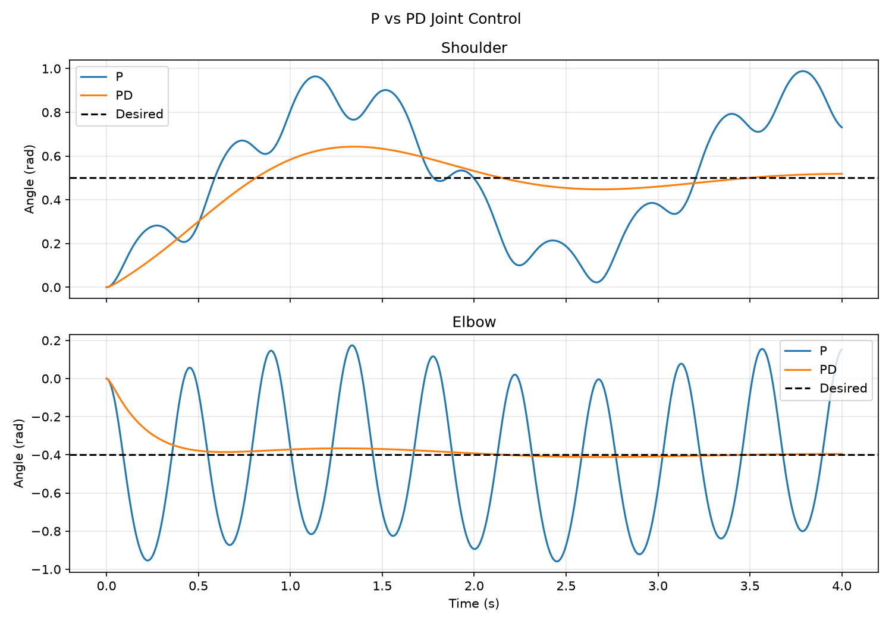

# Controller Comparison: P vs PD

## Question

How does derivative damping affect overshoot, oscillation, settling time,
and final error in the two-joint arm?

## Hypothesis

P control will oscillate more. PD control will reduce overshoot and settle
faster because its derivative term opposes joint velocity.

## Setup

Both controllers used the same conditions:

- Initial joint positions: `(0.0, 0.0)` rad
- Initial joint velocities: `(0.0, 0.0)` rad/s
- Desired joint positions: `(0.5, -0.4)` rad
- Proportional gain: `Kp = 0.2`
- P derivative gain: `Kd = 0.0`
- PD derivative gain: `Kd = 0.05`
- Maximum actuator torque: `0.2 Nm`
- Physics timestep: `0.002 s`
- Duration: `4 s`
- Settling tolerance: `±0.02 rad` for both joints

## Measurements

The experiment measured:

- Final joint-space error
- Shoulder and elbow overshoot
- Settling time
- Number of target crossings

## Results

| Metric | P | PD |
|---|---:|---:|
| Final joint-space error | 0.5993 rad | 0.0193 rad |
| Shoulder overshoot | 0.4884 rad | 0.1430 rad |
| Elbow overshoot | 0.5591 rad | 0.0113 rad |
| Settling time | Did not settle within 4 s | 3.242 s |
| Shoulder target crossings | 5 | 3 |
| Elbow target crossings | 18 | 2 |

## Interpretation

P control repeatedly moved the joints past their desired angles because it
responded only to position error. It did not directly oppose the velocity
accumulated by the arm.

PD control added torque opposite to joint velocity. This reduced overshoot,
damped oscillation, and allowed both joints to remain within the settling
tolerance after approximately 3.242 seconds.

The shoulder trajectory was also affected by elbow motion, demonstrating
dynamic coupling between the two joints. The results support the hypothesis
that derivative damping improves stability for this arm.