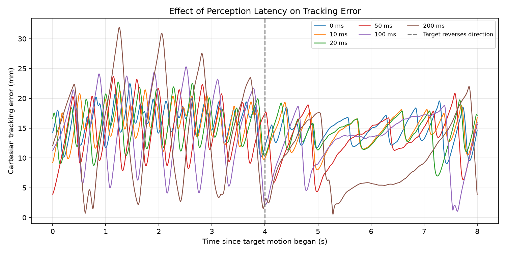

# Perception Latency Experiment

## Question

How does delaying camera-derived target observations affect Cartesian tracking
in the existing vision-guided PD loop?

## Hypothesis

Larger observation delays are expected to increase tracking error because the
controller receives older target estimates while the target keeps moving.
The experiment checks whole-window RMSE, peak error, and final error separately.

## Controlled Setup

- Added observation delays: 0, 10, 20, 50, 100, and 200 ms
- Physics and PD update rates: 500 Hz (0.002 s timestep)
- Camera sampling rate: 25 Hz (every 20 physics steps)
- Image size: 320 x 240 pixels, fixed overhead camera
- Model: `models/arm.xml`, fresh initial state for every run
- PD gains: Kp = 0.2 Nm/rad and Kd = 0.05 Nm s/rad
- Torque limit: +/-0.2 Nm per joint
- Initial target: (0.22, 0.20) m in the x-y plane
- Warmup: target stationary for 4 s; normal perception and control run throughout
- Target motion: one smooth out-and-back movement lasting 8 s
- Total simulated duration: 12 s
- Artificial pixel noise: none; the existing detector and self-occlusion remain

For motion time tau = t - 4 s, the target follows:

```text
x(t) = 0.22 + 0.04 * (1 - cos(2*pi*tau/8))
y(t) = 0.20
```

It starts at x = 0.22 m, reaches x = 0.30 m at simulation time 8 s,
and returns at time 12 s. The same path and timing are used at every delay.

The six reported conditions are deterministic runs on one trajectory. The
script also runs a separate zero-delay diagnostic before the sweep; that
duplicate is not an additional independent trial in the results.

## How Delay Is Applied

The camera captures a frame and the existing detector and pixel-to-world
mapping compute a target estimate. A queue stores that unchanged estimate
with a delivery step equal to the capture step plus the injected delay.

The requested delays correspond exactly to 0, 5, 10, 25, 50, and 100 physics
steps. No sleep is used to model latency. Physics, camera sampling, and joint
feedback continue while observations wait. When multiple observations are
due, the newest delivered estimate is retained. IK uses the delivered target;
PD uses its resulting desired angles and the current joint positions and
velocities. Before the first usable observation, commanded torque is zero.

The added delay models a fixed observation delivery time, not reduced camera
frequency or delayed joint feedback. Camera sampling itself also makes the
latest available target estimate age between deliveries, even at zero added
delay. No inference runtime, variable network delay, or processing backlog is
simulated.

Ground-truth target coordinates place the cube in the environment and measure
error only. They are not supplied to IK or the PD controller.

## Measurements

At each physics sample from simulation time 4 through 12 s, inclusive:

```text
error(t) = sqrt((target_x(t) - end_effector_x(t))^2
              + (target_y(t) - end_effector_y(t))^2)
```

World positions are refreshed before measurement so the target and end
effector correspond to the same simulation state. There are 4001 error samples
per condition.

- Tracking RMSE: square root of the mean squared Cartesian error over those samples
- Peak error: largest Cartesian error in that window
- Final error: Cartesian error at simulation time 12 s
- Missed detections: captures returning no centroid across the full 12 s,
  including warmup (300 capture attempts per run)

The plot subtracts the four-second warmup from its time axis. The dashed line
at motion time 4 s marks the target reversing direction.

## Results

| Added latency (ms) | Tracking RMSE (mm) | Peak error (mm) | Final error (mm) | Missed detections |
|---:|---:|---:|---:|---:|
| 0 | 15.601 | 22.471 | 14.673 | 0 |
| 10 | 15.400 | 21.427 | 16.745 | 0 |
| 20 | 15.261 | 22.744 | 17.096 | 0 |
| 50 | 14.473 | 23.677 | 15.628 | 0 |
| 100 | 14.655 | 25.287 | 15.927 | 0 |
| 200 | 14.401 | 31.877 | 3.803 | 0 |



- [Full-precision summary CSV](../assets/results/perception_latency.csv)
- [Error-history CSV](../assets/results/perception_latency_history.csv)

CSV distances are stored in meters. All six summaries were checked against
their 24,006 saved history samples.

## Interpretation

Increasing delay did not consistently increase tracking RMSE. The 200 ms
condition had a lower whole-window RMSE than zero delay, but its peak error was
31.877 mm versus 22.471 mm, an increase of approximately 41.9%. The 10 ms
condition also had a slightly lower peak than the zero-delay baseline, so peak
error was not strictly monotonic across the full sweep.

The 200 ms curve has large early peaks and periods of low error later in the
movement. Its low final error describes only the endpoint, not sustained
accuracy throughout the run. This explains why RMSE, peak error, and final
error can rank conditions differently.

The hypothesis that larger latency uniformly worsens tracking is not supported
by this trajectory. The measured result is that the largest tested delay
increased worst-case observed error, while other metrics did not necessarily
worsen. Possible interactions with self-occlusion and the timing of the arm's
response remain explanations to investigate, not established causes.

## Limitations

- Only one trajectory, speed, initial state, and set of controller gains were tested.
- No stochastic trials or confidence intervals are reported.
- Self-occlusion remains present and can change as the arm follows different
  trajectories. Its interaction with delay was not independently isolated.
- Zero missed detections means a centroid was returned, not that the whole
  cube was visible or that the centroid was accurate.
- Warmup duration is fixed; it does not guarantee identical or settled arm
  states when motion begins. Each delay is active during warmup too.
- Results describe planar simulated tracking, not physical robot or measured
  hardware communication latency.
- Settling time is not used here because the target moves throughout the
  measurement interval.

## Reproduce

From the repository root with the project dependencies installed:

```bash
PYTHONPATH=src uv run python experiments/perception_latency.py
```

Rendering requires a usable graphics context. The script prints results and
overwrites the summary CSV, history CSV, and plot linked above.
