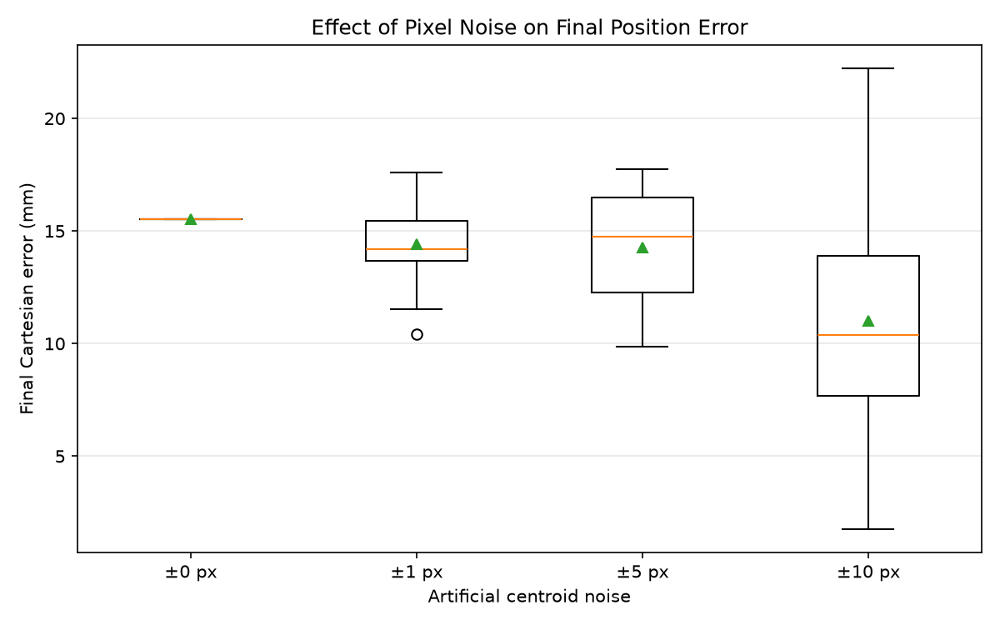

# Perception Noise Experiment

## Question

How does pixel-level target-detection noise affect the final positioning
accuracy and repeatability of the vision-guided arm?

## Hypothesis

Larger pixel noise will increase both the average final Cartesian error and
the variability between trials.

## Setup

The experiment used the complete vision-guided control loop:

```text
camera
→ red-target detection
→ artificial centroid noise
→ pixel-to-world mapping
→ inverse kinematics
→ PD control
→ MuJoCo physics
```

Fixed conditions:

- Noise levels: `0 px`, `±1 px`, `±5 px`, and `±10 px`
- Trials per noise level: `20`
- Random seeds: `42` through `61`
- Noise distribution: independent uniform integer offsets in `u` and `v`
- Perception frequency: `25 Hz`
- Physics frequency: `500 Hz`
- Simulation duration: `4 s`
- Proportional gain: `Kp = 0.2`
- Derivative gain: `Kd = 0.05`
- Maximum actuator torque: `0.2 Nm`

The target's true MuJoCo position was read only after each trial to evaluate
the final error. It was not used by perception, inverse kinematics, or control.

## Measurement

For each trial, the final Cartesian error was calculated as the Euclidean
distance between the end effector and the target's ground-truth position.

The mean and sample standard deviation were then calculated for each noise
level.

## Results

| Pixel noise | Mean error | Standard deviation |
|---|---:|---:|
| 0 px | 15.513 mm | 0.000 mm |
| ±1 px | 14.405 mm | 1.903 mm |
| ±5 px | 14.284 mm | 2.669 mm |
| ±10 px | 11.015 mm | 5.508 mm |

At `±10 px`, individual errors ranged from `1.748 mm` to `22.238 mm`.



## Interpretation

Increasing pixel noise did not increase the mean final error in this
experiment. Therefore, that part of the hypothesis was not supported.

However, the standard deviation increased with every noise level. The
`±10 px` condition produced both very accurate and very inaccurate outcomes,
showing that larger perception noise reduced repeatability.

The clean loop already contained systematic centroid error caused by partial
target occlusion. Random noise sometimes shifted the biased centroid estimate
closer to the target's real center or changed the arm's occlusion trajectory.
In other trials, it shifted the estimate farther away. Because perception,
motion, and occlusion affect one another, the closed loop is nonlinear.

The experiment therefore supports the conclusion that larger pixel noise
makes the final outcome less predictable, even when it does not increase the
mean error.

## Limitations

- Only final error was measured; error throughout the trajectory was not.
- The target was stationary.
- Self-occlusion introduced a systematic error alongside the artificial noise.
- The noise model used bounded uniform integer offsets rather than a
  camera-derived noise distribution.
